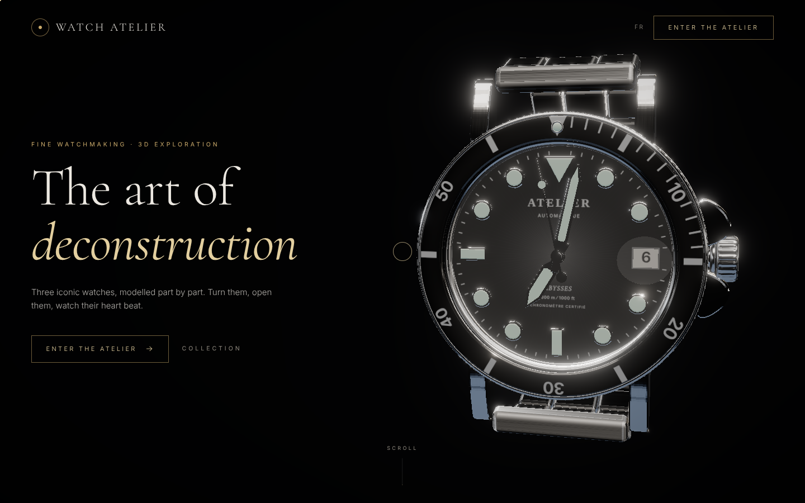
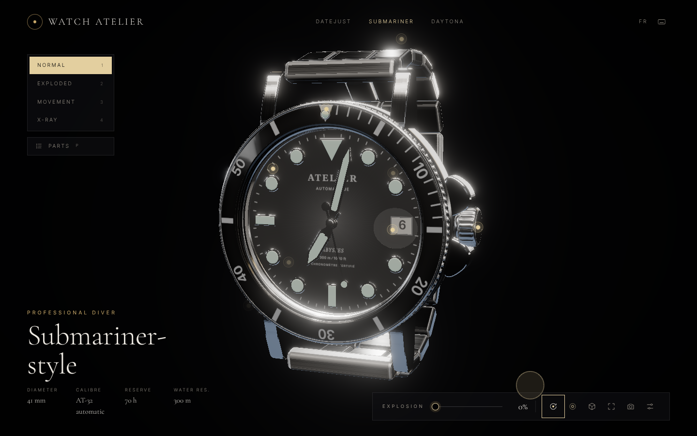
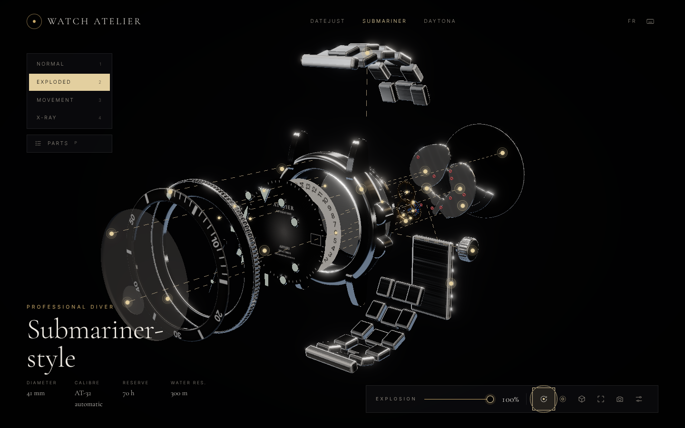
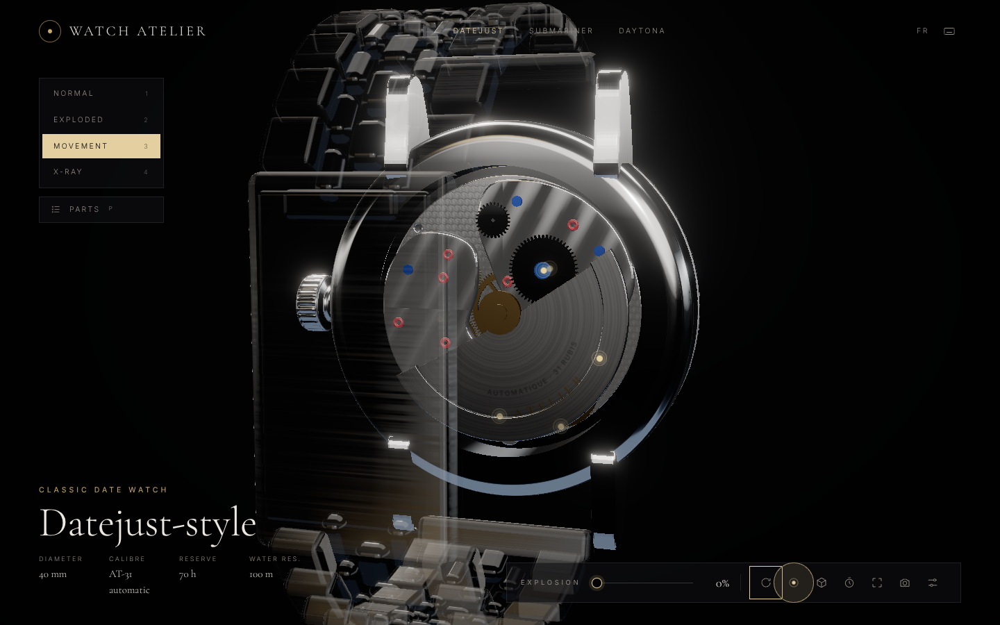

# Watch Atelier

Visualiseur 3D interactif de montres de prestige : rotation libre, **vue éclatée** pièce par pièce, **mouvement mécanique animé**, fiches techniques, **configurateur** temps réel et landing en scrollytelling. Trois modèles génériques : *Datejust-style*, *Submariner-style*, *Daytona-style*.

| Landing | Atelier | Vue éclatée | Calibre |
| --- | --- | --- | --- |
|  |  |  |  |

> Projet de démonstration. Aucun logo ni marque déposée n'est reproduit ; branding fictif « ATELIER ». Aucune affiliation avec un fabricant.

---

## Démarrage

```bash
npm install
npm run dev        # http://localhost:5173
npm run build      # typecheck + build de production dans dist/
npm run preview    # sert dist/ sur http://localhost:4173
```

Node ≥ 20. Déploiement : `dist/` est statique (routage par hash, aucune réécriture serveur nécessaire). `vercel.json` et `netlify.toml` sont fournis — importer le dépôt suffit.

### Scripts

| Script | Rôle |
| --- | --- |
| `npm run dev` / `build` / `preview` | Développement, build, prévisualisation |
| `npm run typecheck` | Vérification TypeScript |
| `npm run export:glb` | Exporte les 3 montres procédurales en GLB (`public/models/<id>.src.glb`) — nécessite `npm run dev` |
| `npm run optimize` | Compresse les GLB de `public/models/` (dedup, instancing, prune, weld, textures WebP ≤ 2048, **Meshopt**). Échoue si un modèle dépasse 8 Mo |
| `npm run poster` | Regénère l'image de façade du hero (`public/poster.webp`) depuis le rendu 3D réel |
| `npm run test:smoke` | Test end-to-end Playwright desktop + mobile (navigation, modes, sélection, isolation, configurateur, raccourcis, capture PNG, erreurs JS) — nécessite `npm run preview` |
| `npm run test:visual` | Captures Playwright desktop + mobile dans `docs/screenshots/` |
| `npm run lighthouse` | Audit Lighthouse desktop + mobile du build |

Paramètres d'URL utiles : `?q=low` / `?q=high` (force la qualité), `?source=glb` (charge les GLB optimisés au lieu du procédural), `?debug` (panneau Leva, dev uniquement), `?poster` (rendu sans interface).

---

## Fonctionnalités

- **Viewer 3D** — caméra à inertie douce (camera-controls), zoom borné, rotation automatique après inactivité, studio d'éclairage procédural (lightformers, aucun HDRI à télécharger), ombres de contact, PBR : acier 904L, or jaune, or rose, bicolore, céramique, cadrans laqués ou **soleillés** (carte d'anisotropie radiale), verre saphir **transmissif** (IOR 1,77), bloom léger sur la luminescence, tonemapping AgX.
- **Vue éclatée** — slider 0 → 100 % (+ mode Éclaté et scroll sur la landing). Chaque pièce suit son vecteur d'explosion (`parts.json`) avec easing et **stagger** séquentiel ; les maillons du bracelet s'écartent un à un ; **lignes de liaison** pointillées entre position assemblée et éclatée.
- **Hotspots & fiches** — points cliquables ancrés aux pièces (masqués quand ils passent derrière la montre), vol de caméra vers la pièce, panneau FR/EN : nom, matériau (suit le métal configuré), rôle, description, anecdote. **Isolation** (les autres pièces deviennent translucides), mode **Rayons X** (shader Fresnel) et **fil de fer**, nomenclature complète accessible au clavier.
- **Mouvement vivant** — aiguilles à l'heure réelle, trotteuse à 8 pas/s (28 800 alt/h), balancier à 4 Hz, spiral qui « respire », échappement qui avance d'1/30 de tour par alternance, ancre qui bascule, rouage et rotor animés ; ralenti ×1/8 ; chronographe qui démarre en mode Mouvement (Daytona).
- **Configurateur** — cadran (noir, bleu, vert, champagne), lunette (cannelée/lisse, céramique noire/bleue/verte, tachymètre céramique/métal), bracelet trois rangs / cinq rangs, métal (acier, or jaune, or rose, bicolore).
- **Catalogue** — 3 modèles, transition 3D glissée/pivotée entre eux (GSAP).
- **Modes** — Normal / Éclaté / Mouvement / Rayons X, raccourcis clavier, **capture PNG**.
- **Landing scrollytelling** — hero 3D → la boîte → éclatement au scroll → le calibre vu par le fond → collection.

### Raccourcis clavier (atelier)

`1`–`4` modes · `E` éclaté · `←` `→` pièce précédente/suivante · `I` isoler · `Échap` fermer · `R` rotation auto · `H` repères · `W` fil de fer · `M` ralenti · `C` configurateur · `P` nomenclature · `V` recentrer · `S` capture PNG · `[` `]` modèle précédent/suivant · `?` aide.

---

## Architecture

```
src/
  App.tsx                  routage par hash, façade (chargement différé de la 3D)
  pages/                   Landing (scrollytelling) · Atelier (UI flottante)
  scenes/                  Experience (Canvas unique), Studio, CameraRig, WatchStage,
                           Effects, landingKeyframes, SceneUtils (ready gate, capture PNG)
  components/three/        Part (nœud interactif), Hotspot, ExplodeLines, overrides (X-ray, translucidité)
  components/ui/           PartPanel, Configurator, AtelierControls, Loader, Cursor, HeroPoster, Icons…
  models/
    ProceduralWatch.tsx    assemblage d'une montre (montage progressif par étapes)
    GLBWatch.tsx           chargement d'un GLB dont les nœuds sont nommés selon parts.json
    materials.ts           bibliothèque PBR selon la configuration
    dims.ts                cotes de référence (mm)
    procedural/            CaseParts, BezelParts, DialParts, MovementParts, Bracelet
  data/
    parts.json             nomenclature + métadonnées + vecteurs d'explosion (documenté en tête)
    watches.ts             catalogue, options du configurateur
    i18n.ts                textes d'interface FR/EN
  lib/                     geometry (profils, révolutions modulées, engrenages…), textures (canvas),
                           scheduler (tâches différées), explode (stagger), router, env
  store/                   useAtelier (Zustand) + `anim` (valeurs animées hors React), useDebug (Leva)
  debug/                   Leva + exporteur GLB (dev uniquement, absents du build)
scripts/                   optimize, export-glb, make-poster, smoke, screenshots, lighthouse, views/probe (inspection)
public/models/             GLB optimisés (optionnels, `?source=glb`)
```

Repère : 1 unité = 1 mm, **+Z = face cadran**, **+Y = 12 h**, **+X = 3 h (couronne)**.

### `parts.json`

Chaque pièce = un nœud nommé par son `id` (identique dans le modèle procédural et dans les GLB exportés) :

```jsonc
{
  "id": "escapeWheel",           // nom du nœud 3D
  "group": "movement",           // exterior | movement (filtrage des repères par mode)
  "models": ["*"],               // modèles concernés
  "explode": [0, 0, -39],        // déplacement (mm) à 100 % d'éclatement
  "order": 16,                   // rang dans la séquence (stagger)
  "anchor": [2.6, -7.6, 0.4],    // position locale du repère / origine de la ligne de liaison
  "metal": false,                // matériau = métal du configurateur ?
  "name":     { "fr": "Roue d'échappement", "en": "Escape wheel" },
  "material": { "fr": "…", "en": "…" },
  "function": { "fr": "…", "en": "…" },
  "description": { "fr": "…", "en": "…" },
  "funFact":  { "fr": "…", "en": "…" }
}
```

Pièces : verre saphir, loupe, disque de lunette, lunette, aiguilles (heures, minutes, trotteuse, compteurs), index appliqués, cadran, disque de quantième, couronne, poussoirs, carrure (+ cornes, rehaut), fond de boîte, bracelet, fermoir — et pour le calibre : platine, barillet, roue de centre, roue moyenne, roue de secondes, roue d'échappement, ancre, balancier, spiral, rubis, ponts (rochet, roue de couronne, vis bleuies), pont de balancier, rotor.

---

## Ajouter un modèle

### A. Variante procédurale (recommandé)

1. Ajouter une entrée dans `WATCHES` (`src/data/watches.ts`) : `id`, nom générique, specs, `features` (`date`, `chrono`, `crownGuards`), options de lunette/cadran, configuration par défaut.
2. Étendre si besoin le type `WatchId`, puis les branches par modèle dans `procedural/DialParts.tsx` (index, aiguilles), `lib/textures.ts` (impressions du cadran) et `ProceduralWatch.tsx`.
3. Ajouter les pièces spécifiques dans `parts.json` (`models: ["monid"]`).

### B. Modèle GLB (CC0 / CC-BY ou maison)

1. Nommer les nœuds selon les `id` de `parts.json` (`case`, `bezel`, `dial`, `hourHand`… ; les aiguilles doivent contenir un nœud pivot enfant). Unités en mm, cadran vers +Z, 12 h vers +Y.
2. Déposer le fichier dans `public/models/<id>.src.glb` puis `npm run optimize` → `public/models/<id>.glb` (< 8 Mo, contrôlé).
3. Renseigner `glb: '/models/<id>.glb'` sur l'entrée du catalogue (ou tester avec `?source=glb`).
4. Ajouter l'attribution dans `CREDITS.md`.

Les nœuds reconnus deviennent automatiquement des pièces interactives (éclatement, repères, isolation, rayons X) ; les autres sont affichés tels quels.

---

## Performance

Mesures Lighthouse (build de production, Chromium headless) :

| | Performance | Accessibilité | Bonnes pratiques | SEO |
| --- | --- | --- | --- | --- |
| Desktop | **100** | 100 | 100 | 100 |
| Mobile | **98** | 100 | 100 | 100 |

Techniques :

- **Façade** : sur la landing, le moteur 3D (~390 Ko gzip) n'est chargé qu'à la première interaction (ou après 3,5 s / 7 s sur mobile). Un poster WebP (rendu réel, `srcset` 760/1400 px, préchargé) occupe exactement l'emplacement de la montre puis s'efface en fondu enchaîné. L'atelier charge la 3D immédiatement.
- **Découpage** : chunks `react`, `three`, `r3f`, `gsap` ; GSAP et Leva absents du chemin critique (Leva absent du build).
- **Montage progressif** : les pièces sont montées en 8 étapes (une toutes les deux frames) et les textures canvas sont dessinées par un ordonnanceur `requestIdleCallback` sur des placeholders 4×4 (aucune recompilation de shader) → pas de long task bloquante.
- **Rendu** : DPR adaptatif (`PerformanceMonitor` : 1 → 1,75/2), qualité auto (`low` sur pointeur tactile ou ≤ 4 cœurs : pas de transmission, pas de MSAA, ombres de contact figées), **instancing** des maillons, géométries/textures partagées et libérées, effets légers (bloom mipmap, AgX, vignette).
- **Modèles GLB** : 2,4 – 2,9 Mo par montre après `npm run optimize` (18 Mo bruts).
- Repli élégant (illustration SVG) si WebGL 2 est indisponible.

## Accessibilité

Lien d'évitement, `lang` dynamique FR/EN, rôles ARIA (radiogroups pour modes/options, dialog pour l'aide, `aria-pressed`, `aria-live` du chargement), focus visibles, nomenclature des pièces navigable au clavier, raccourcis complets, `prefers-reduced-motion` respecté (pas de rotation auto, transitions instantanées, curseur natif), curseur personnalisé uniquement sur pointeur fin.

---

## Choix & hypothèses

- **Modèles 100 % procéduraux.** Recherche préalable de GLB libres : les modèles trouvés sont soit des maillages uniques générés par IA (pièces non séparées), soit des mouvements isolés sous licence d'attribution sans boîte/cadran cohérents, soit payants ou soumis à compte. Aucun ne fournit une montre complète **et** un calibre en pièces nommées. Les montres sont donc générées par le code (révolutions de profils congés, lunettes cannelées/crantées par modulation, engrenages à denture et croisillons, échappement à dents « club », spiral en tube, bracelets instanciés sur une super-ellipse), ce qui garantit l'absence de marque déposée, un poids nul en téléchargement et des pièces parfaitement nommées. Le pipeline GLB (export, compression, chargement) est néanmoins complet et testé.
- **Noms génériques** « -style » et branding fictif « ATELIER » ; aucune couronne, aucun texte de marque. Les impressions (« Chronomètre certifié », « Abysses 300 m », « Tachymètre ») sont génériques.
- **Studio procédural** plutôt qu'un HDRI externe : reflets contrôlés, aucune dépendance réseau.
- **Canvas unique** partagé landing/atelier pour des transitions 3D continues ; routage par hash pour un hébergement statique sans configuration.
- **Textures** dessinées au canvas (cadrans, lunettes, quantième, perlage, Côtes de Genève, rotor) plutôt que KTX2 : quelques Ko de code au lieu de Mo d'images. Les GLB exportés embarquent ces textures en WebP (KTX2 nécessiterait l'outil externe `toktx`, absent ici — `textureCompress` peut être remplacé par `toktx` dans `scripts/optimize.mjs`).
- **Échelle des animations** : la trotteuse et le balancier sont fidèles (8 Hz / 4 Hz) ; le rouage est accéléré pour être visible ; le rotor simule des mouvements de poignet.
- **Outils** : les serveurs MCP Context7 et Blender n'étaient pas disponibles dans l'environnement de développement ; les API (R3F 9, drei 10, three r186, camera-controls, postprocessing) ont été vérifiées directement dans les définitions TypeScript installées. Chaque jalon a été validé par captures Playwright desktop + mobile.

## Licence

Code : MIT. Voir `CREDITS.md` pour les dépendances et polices.
